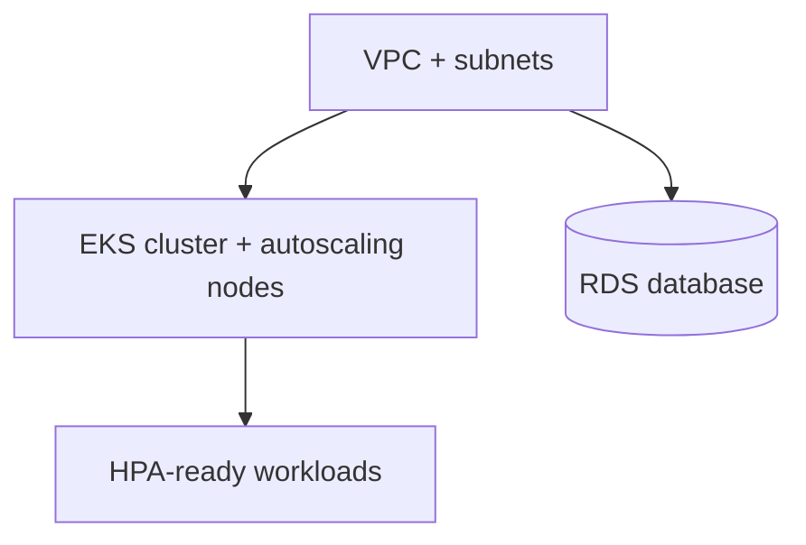

# Terraform AWS Modules — EKS · RDS · VPC

> Reusable, opinionated Terraform modules to provision a production-ready AWS stack: VPC networking, an EKS cluster with autoscaling node groups, and an RDS database.


## Why

Spinning up the same VPC → EKS → RDS foundation for every project is repetitive and error-prone. These modules encode sane defaults (private subnets, autoscaling, HPA-ready, least-privilege IAM) so a new environment is a few lines of HCL.

## Modules

| Module | What it provisions | Docs |
|--------|--------------------|------|
| `vpc` | VPC, public/private subnets, NAT, route tables | [`modules/vpc`](modules/vpc/) |
| `eks` | EKS control plane + managed node groups with cluster autoscaler IAM | [`modules/eks`](modules/eks/) |
| `rds` | RDS PostgreSQL instance, subnet group, security group | [`modules/rds`](modules/rds/) |

## Usage

```hcl
module "vpc" {
  source = "github.com/AntoniRomera/terraform-aws-modules//modules/vpc"
  name   = "demo"
  cidr   = "10.0.0.0/16"
  azs    = ["eu-west-1a", "eu-west-1b"]
}

module "eks" {
  source       = "github.com/AntoniRomera/terraform-aws-modules//modules/eks"
  cluster_name = "demo"
  vpc_id       = module.vpc.vpc_id
  subnet_ids   = module.vpc.private_subnet_ids
  node_groups = {
    default = { instance_types = ["t3.medium"], min_size = 1, max_size = 5, desired_size = 2 }
  }
}
```

## Architecture



## Examples

| Example | What it shows |
|---------|---------------|
| [`examples/full-stack`](examples/full-stack/) | Wires VPC + EKS + RDS together into a complete environment. Copy `terraform.tfvars.example` to `terraform.tfvars` to customize. |
| [`examples/remote-state`](examples/remote-state/) | Consumes the modules with an S3 + DynamoDB remote backend. The [`bootstrap/`](examples/remote-state/bootstrap/) subdir provisions the state bucket and lock table first. |

## Requirements

- Terraform >= 1.5.0 (CI pins 1.9.8)
- AWS provider `>= 5.40, < 6.0` (plus `tls >= 4.0` for EKS IRSA and `random >= 3.5` for RDS)
- Configured AWS credentials (use a profile or OIDC — never hardcode keys). See [`.env.example`](.env.example) for the environment variables a real `plan`/`apply` expects.

## Development

A `Makefile` wraps the common workflows. Formatting, validation, and linting all run **offline** (`-backend=false`, no AWS credentials required):

```bash
make fmt-check         # fail if any HCL is unformatted
make validate          # terraform init + validate across modules + examples
make examples-validate # init + validate the examples/ configurations only
make lint              # tflint with .tflint.hcl
make test              # fmt-check + validate (CI test entrypoint)
```

`tflint` is configured via [`.tflint.hcl`](.tflint.hcl) with the recommended Terraform ruleset plus snake_case naming, documented-variables/outputs, and required-version/providers rules.

## CI

[`.github/workflows/ci.yml`](.github/workflows/ci.yml) runs on every push and pull request to `main`:

1. `make fmt-check` — formatting gate
2. `make validate` — `terraform init -backend=false` + `validate` for all modules and examples
3. `make lint` — `tflint`

No AWS credentials are needed in CI because every step runs with `-backend=false`.

## Roadmap

- [x] Remote state example (S3 + DynamoDB lock) — see [`examples/remote-state/`](examples/remote-state/)
- [x] `examples/` folder with a full stack — see [`examples/full-stack/`](examples/full-stack/)
- [x] CI plan/validate with `tflint` — `.tflint.hcl` + `make validate lint`, wired into [`.github/workflows/ci.yml`](.github/workflows/ci.yml)

## License

[MIT](LICENSE) © 2026 Antoni Romera Luis
